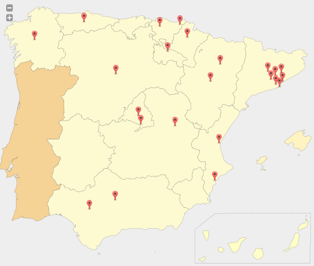
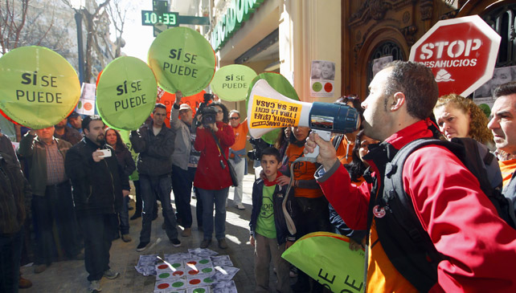
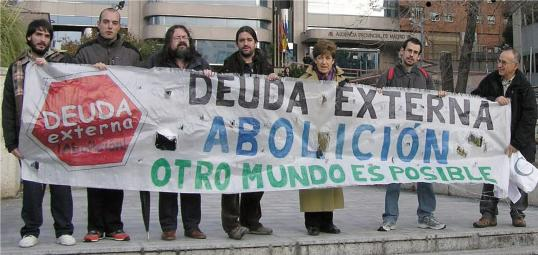
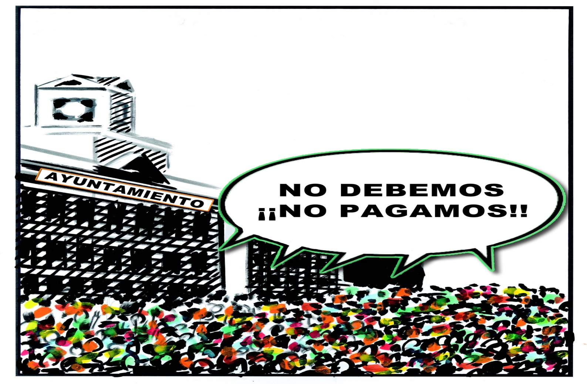

```{r echo=F}
require(knitr)
require(rCharts)
require(htmlwidgets)
require(htmlTable)
knitr::opts_chunk$set(comment=NA, results='asis', tidy=F, message=T, cache=F, echo=F)
options(RCHART_WIDTH=800, RCHART_HEIGHT=400, xtable.type='html')
```


http://auditoriaciudadana.net  
[@AuditoriaMadrid](https://twitter.com/AuditoriaMadrid)

<script src="http://ajax.googleapis.com/ajax/libs/jquery/1.9.1/jquery.min.js"></script>

--- &vertical

## ¿Qué es la PACD?

PACD son las siglas de Plataforma Auditoría Ciudadana de la Deuda

> - **Plataforma**: Un espacio de participación abierto, no institucional y no vinculado a partidos políticos.
> - **Ciudadana**: Formado por personas y colectivos no dependientes de las instituciones que habitan un territorio.
> - **Auditoría**: Para realizar un análisis y explicación de las cuentas públicas con la máxima transparencia y pedagogía.
> - **Deuda**: Centrada en los gastos, ingresos y el endeudamiento de las administraciones públicas. 

<!-- Incremental lists -->
<script>
$('ul.incremental li').addClass('fragment')
</script>

***

## Origen de la PACD
La PACD surge en marzo de 2012 como respuesta de la sociedad civil organizada a la crisis de la deuda y los recortes de derechos derivada de ella. 

Desde entonces se ha extendido por todo el territorio del Estado español.



<!-- *** -->


<!-- ```{r echo=F, results='asis'} -->
<!-- #require(leaflet) -->
<!-- map <- Leaflet$new() -->
<!-- map$setView(c(39.5,-3.5), zoom = 6) -->
<!-- map$marker( -->
<!--   c(40.4381311,-3.8196242), -->
<!--   bindPopup = '<p>PACD Madrid<br>pacd.madrid@gmail.com</p>' -->
<!-- ) -->
<!-- map$set(height=600) -->
<!-- map -->
<!-- ``` -->

*** 

## Algunos logros
### A nivel estatal

- [Análisis de la deuda del Estado español](https://www.dropbox.com/s/efrzk11n4mp62hb/Analisis%20Deuda%20EE%20PACD%20Definitivo.pdf)
- [Informe sobre el rescate a la banca](http://auditoriaciudadana.net/docs/InformeRescatesBancarios.pdf)
- [Informe sobre la política fiscal del Estado español](https://www.dropbox.com/s/045wemf22zyhby3/Informe%20Pol%C3%ADticas%20Fiscales.pdf)
- [Informe sobre el gasto y la deuda militar](https://www.dropbox.com/s/ses4bwmlvxqzq77/Informe%20gasto%20y%20deuda%20militar%202013.pdf)

***
## Algunos logros
### A nivel autonómico

- [Grupo de auditoría de la sanidad](http://auditasanidad.org/)
- [Informe sobre la privatización de la sanidad en la Comunidad de Madrid](https://drive.google.com/file/d/0Bxbsc23OVn-8SHVEMHpBNHV5VFlJZW0zZWg1V0VTVC1uYWIw/view?usp=sharing)

***
## Algunos logros
### A nivel municipal

- [Observatorios Ciudadanos Municipales](http://ocmunicipal.net/)
- Red de municipios de Madrid por la Auditoría de la Deuda

--- &vertical

## Objetivos de la PACD
### Más allá de una simple auditoría contable

> - Ejercer el derecho a la información sobre las cuentas públicas.
> - Lograr una gestión de los recursos públicos transparente y comprensible. 
> - Democratizar la gestión de los recursos públicos.
> - Empoderar a la ciudadanía para liberarse del sometimiento de la deuda. 
> - Transformar el sistema económico y en particular la gestión de los recursos públicos para que ponga en el centro las necesidades de las personas. 

*** 

## Sostener los pilares de la democracia 


--- &vertical

## ¿Qué es una Auditoría Ciudadana? 

- Una herramienta de análisis crítico de la política presupestaria, fiscal y de endeudamiento de un gobierno, para decidir que gastos o ingresos, y la deuda generada por ellos, pueden considerarse ilegítimos y exigir su no pago.
- Es realizada por la ciudadanía (aunque debe contar con la ayuda de los técnicos de las administraciones públicas).
- Además del aspecto financiero abarca otros aspectos:
  - Social
  - Ambiental
  - Género
  - <span>...</span>
  
***

## ¿Por qué ciudadana?

- La ciudadanía es la única soberana para decidir sobre la ilegitimidad o no de un gasto o ingreso ejecutado en su territorio (Estado, región, ciudad o barrio).
- Los instrumentos institucionales de control de la gestión de los recursos públicos son insuficientes y están viciados. El control debe ejercerse por la población.

--- &vertical  

## El concepto de ilegitimidad
No es un concepto jurídico, sino **político**.

Un concepto que evoluciona con el con el contexto social y que cada población debe construir. 

***

### La esclavitud y los movimientos abolicionistas


***

### Los derechos de la mujer y el movimiento sufragista


***

### Los derechos laborales y el movimiento obrero


***

### Los desahucios y la PAH



***

### La deuda y el movimiento anti-deuda



--- ds:alert &vertical

## Deuda ilegítima

> Aquella contraída sin contar con la población y que vulnera derechos humanos, sociales, económicos, culturales, medioambientales o de género de una parte de la población en favor de los intereses de una minoría.

***

## Deuda ilegal

> Aquella en cuya contratación hubo fraude de ley, bien porque no se siguieron los procedimientos legales apropiados, incluidos aquellos relativos a la autoridad para firmar o aprobar préstamos, títulos de deuda o garantías por parte de sectores o sucursales representantes del gobierno del Estado prestatario, bien porque hubo una clara mala conducta del prestamista, que incluya sobornos, coerción o una influencia indebida, o porque implicara condiciones que contravinieran leyes nacionales o internacionales, o las políticas públicas.

***

## Deuda odiosa

> Aquella contraída por un Estado de manera no democrática e injusta en contra de los intereses legítimos de la población, y que los prestamistas conocían o deberían haber conocido que se estaba incurriendo en una violación de los principios democráticos —consentimiento, participación, transparencia y responsabilidad—.

***

## Deuda insostenible

> Una deuda cuyo pago implica para el Estado serias dificultades para cumplir con sus obligaciones referentes a los derechos humanos básicos, tales como los relacionados con la salud, la educación, el agua, las redes de saneamiento y la vivienda digna, o para invertir en infraestructuras públicas y programas necesarios para el desarrollo económico y social, provocando un deterioro en las condiciones de vida de la población.

***

## Deuda ilegítima
<iframe width="853" height="480" src="https://www.youtube.com/embed/y9ZUc_A0vWM" frameborder="0" allowfullscreen></iframe>


--- &vertical

## La deuda del Ayuntamiento de Madrid

```{r deuda_madrid, results='asis', tidy = F, message = F, echo = F}
data = read.table("datos/deuda_ayuntamiento_madrid.csv", header = TRUE, sep=",")
p1 <- nPlot(Deuda ~ Año, group="Alcalde", data = data, type = "multiBarChart")
p1$chart(showControls = F)
p1
```
<span class="footnote">Fuente: Elaboración propia a partir de datos del Banco de España</span>

***

## ¿A quién debemos?

```{r acreedores_madrid, comment=NA, results='asis', tidy = F, message = F, echo = F}
data = read.table("datos/acreedores_ayuntamiento_madrid.csv", header = TRUE, sep=",")
#options(RCHART_WIDTH = 800, RCHART_HEIGHT = 400)
p2 <- nPlot(Cantidad ~ Acreedor , data = data, type = "pieChart")
# p2$chart(showControls = F)
p2
#p2$save('fig/deuda_madrid.html', cdn = TRUE)
#cat('<iframe src="fig/deuda_madrid.html" width=100%, height=600></iframe>')
```
<span class="footnote">Fuente: Elaboración propia a partir de datos del Banco de España</span>

--- &vertical

## ¿Cómo se ha generado la deuda?

Coste de algunos "elefantes blancos" (millones €)
```{r }
data = read.table("datos/infraestructuras_madrid.csv", header = TRUE, sep=",")
colnames(data) <- c("Infraestructura", "Presupuesto inicial", "Coste final", "Desviación")
tmp <- htmlTable(data, align="lrrr", rnames=FALSE, css.class="colortable", 
  tfoot="<span class=\"footnote\">Fuente: El Confidencial y El País</span>")
(tmp <- gsub('<td', '<td nowrap="nowrap"; ', tmp))
```

<!--

*** =pnotes

- El precio de la licitación de la M-30 se elevó hasta los 4.250 millones de €.El coste de los 10.406 millones de euros incluye los intereses a pagar hasta 2040.
- La obra del centro acuático está parada desde 2010 por motivos económicos. Presupuesto inicial de 137 millones de euros.
- FCC exige 33 millones más debido a sobrecoste adicional de la caja mágica.
-->

*** 

## El caso de la Caja Mágica


***

## El caso de la Caja Mágica
### Indicios de ilegitimidad

- Sobrecoste: 154 millones €.
- Coste mantenimiento: 1,35 millones € /año &rArr; Pérdidas anuales.
- Concebida para el deporte de élite.
- Sólo se usa para el open de tenis de Madrid. 
- Concesión a empresas privadas para gimnasio y otros eventos ([MOMO Spot Club](http://momosportsclub.com/momo-caja-magica))
- Falta de instalaciones deportivas de base en el distrito. 

***

## El coste de oportunidad 

Con 154 millones de € se podría haber construido: 

<table class="plain">
<tr class="fragment">
  <td style="vertical-align: middle">5 polideportivos</td>
  <td>
      
      
      
      
  </td>
</tr>
<tr class="fragment">
  <td style="vertical-align: middle">5 bibliotecas</td>
  <td>
      
      
      
      
  </td>
</tr>
<tr class="fragment">
  <td style="vertical-align: middle">5 escuelas<br/>infantiles</td>
  <td>
      
      
      
      
  </td>
</tr>
<tr class="fragment">
  <td style="vertical-align: middle">5 Centros de<br/>mayores</td>
  <td>
      
      
      
      
  </td>
</tr>
<tr class="fragment">
  <td style="vertical-align: middle">1 parque de 30 Ha</td>
  <td></td>
</tr>
</table>

***

## El caso del soterramiento de la M-30


***

## El caso del soterramiento de la M-30
### Indicios de ilegitimidad

- Sobrecoste: 8076 millones € (2750 € por habitante).
- Mantenimiento subcontratado a la empresa Calle 30 (80% pública, 20% Ferrovial y Dragados)
  - Pago anual a Calle 30: 125 millones €/año.
  - Coste estimado real de mantenimiento: 37.5 millones €/año.
  - Beneficios para Ferrovial y Dragados desde 2005: 39,8 millones € (dividendos) 66,4 millones € (intereses préstamo inicial de 125 millones de € a tipo fijo)
  - IVA desde 2005: 298,78 millones €.
  - Impuesto de sociedades desde 2008: 106 millones €.
  
*** 

## El caso del soterramiento de la M-30
#### Sobrecoste del mantenimiento (millones €)

```{r coste_mantenimiento_m30, comment=NA, results='asis', tidy = F, message = F, echo = F}
data <- read.table("datos/sobrecoste_mantenimiento_m30.csv", header = TRUE, sep=",")
colnames(data) <- c("Pagos", seq(2006,2014))
require(reshape)
data <- melt(data, id=c("Pagos")) 
colnames(data) <- c("Pagos", "Año", "Cantidad")
data[["Cantidad"]] <- data[["Cantidad"]]/1000000
p3 <- nPlot(Cantidad ~ Año, group="Pagos", data = data, type = "multiBarChart")
p3
```

***

## El caso del soterramiento de la M-30
### Indicios de ilegitimidad

- Declarada ilegal por el tribunal de justicia de la UE por no realizar evaluación ambiental.
- Emisiones de PM10  y de NO2.
- Eliminación de 13000 árboles.
- Vertidos contaminantes al río Manzanares. 
- Daños irreversibles al patrimorio histórico (puente de Toledo, puente de Segovia).
- Incremento de la recaudación para pagar la deuda (incremento del IBI un 200% y creación tasa de basuras).


---

## ¿Qué auditar? 

- .fragment Liquidación de los presupuestos
- .fragment Préstamos adquiridos
- .fragment Infraestructuras construídas
- .fragment Contrataciones públicas
- .fragment Servicios prestados
- .fragment Impuestos y tasas

<!-- --- -->

<!-- ## Metodología de trabajo para los distritos -->

<!-- ```{r cache=F} -->
<!-- require(DiagrammeR) -->
<!-- dg1 <-DiagrammeR::grViz(" -->
<!--   digraph neato { -->


<!--     rankdir=LR; -->
<!--     node[width=1,height=1,fixedsize=true]; -->

<!--     { rank=same; B ; C} -->

<!--     edge[weight=20]; -->
<!--     A -> B [label='&beta;']; -->
<!--     B -> O [label='&gamma;']; -->
<!--     edge[weight=1]; -->

<!--     C -> { B O } -->

<!--     A -> O[label='&beta;&gamma;']; -->

<!--     A[label='Assigned\ntreatment',shape=circle,fillcolor='lightblue',style='filled']; -->
<!--     B[label='Actual\ntreatment',shape=circle,fillcolor='lightblue',style='filled']; -->
<!--     C[label='Confounder',shape=circle,fillcolor='MistyRose',style='filled']; -->
<!--     O[label='Outcome',shape=circle,fillcolor='lightblue',style='filled']; -->


<!--   } -->
<!-- ", width=650, height=600, engine="dot") -->
<!-- saveWidget(dg1, 'diagrammer1.html') -->
<!-- cat('<iframe src="./diagrammer1.html" width=100% height=100% allowtransparency="true"> </iframe>') -->
<!-- ``` -->

---

## ¿Cómo puedo participar?

> - Formándome (presupuestos, contratación pública, auditoría, nuevas tecnologías, etc.).
> - Identificando casos de presuntas ilegitimidades en el barrio, distrito o ciudad.
> - Recabar y socilitar información al Ayuntamiento (Subdirección General de Auditoría de la Deuda y Concejalías de distrito).
> - Exigir al Ayuntamiento más transparencia (datos abiertos).
> - Difundir los hallazgos y los resultados de la auditoría. 
> - Presionar al Ayuntamiento para que audite los casos identificados y no page la deuda ilegitima.
> - Extender el proceso a otros distritos o municipios.

<!-- Incremental lists -->
<script>
$('ul.incremental li').addClass('fragment')
</script>

--- 

## ¿Qué ofrece la PACD?

> - Formación (presupuestos, contratación pública, auditoría, nuevas tecnologías, etc.).
> - Definición previa de ilegitimidad. 
> - Ficha para detectar indicios de ilegitimidad.
> - Observatorio Ciudadano Municipal de Madrid: http://ocm.madrid.tomalaplaza.net.
> - El blog Madrid Audita Madrid: http://www.madridauditamadrid.org (formación, denuncia, difusión).
> - Intercambio de experiencias de auditorías en otros municipios (Red de Municipios de Madrid por la Auditoría).

<!-- Incremental lists -->
<script>
$('ul.incremental li').addClass('fragment')
</script>

---

## Gracias por su atención


