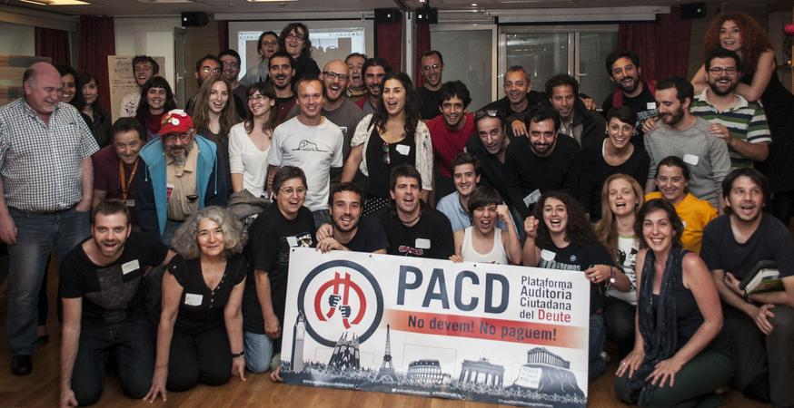
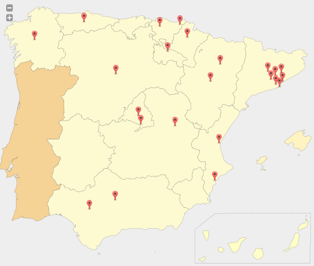
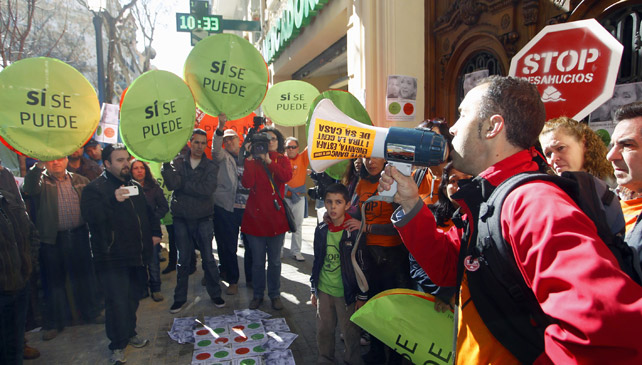
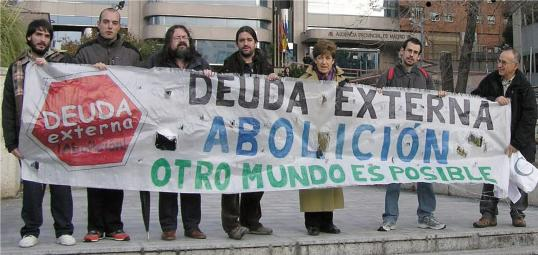
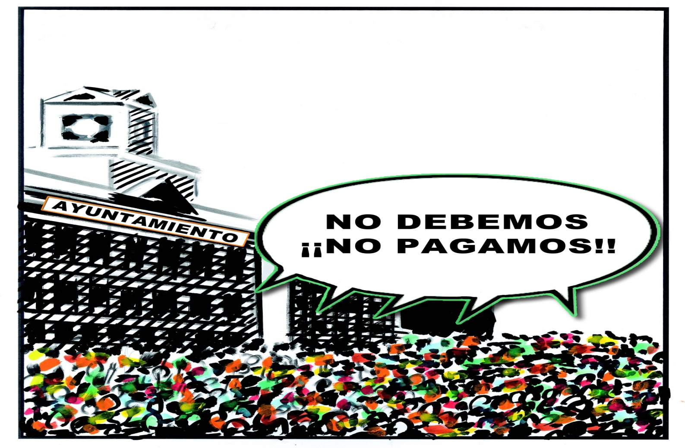

http://auditoriaciudadana.net  
[@AuditoriaMadrid](https://twitter.com/AuditoriaMadrid)

---

## ¿Qué es la PACD?

PACD son las siglas de Plataforma Auditoría Ciudadana de la Deuda

- **Plataforma** Un espacio de participación abierto, no institucional y no vinculado a partidos políticos.
- **Ciudadana**: Formado por personas y colectivos no dependientes de las instituciones que habitan un territorio.
- **Auditoría**: Para realizar un análisis y explicación de las cuentas públicas con la máxima transparencia y pedagogía.
- **Deuda**: Centrada en los gastos, ingresos y el endeudamiento de las administraciones públicas.

----

## Origen de la PACD
La PACD surge en marzo de 2012 como respuesta de la sociedad civil organizada a la crisis de la deuda y los recortes de derechos derivada de ella.

----

## Antecedentes de la PACD

- 15 M. Confluencia de movimientos sociales preocupados por la cuestión de la deuda en el Tercer Mundo.
- REG, ¿Quién debe a quién?, CADTM, Ecologistas en acción, Economistas sin fronteras, etc. 
- Crisis de la deuda en 2011-12: de la deuda de la periferia del mundo a la deuda en la periferia de Europa
- Tratamiento del problema de la deuda en nuestro propio entorno.

----

## ¿Dónde estamos?

Desde entonces se ha extendido por todo el territorio del Estado español.

----

## Algunos logros

### A nivel estatal

- [Análisis de la deuda del Estado español](https://www.dropbox.com/s/efrzk11n4mp62hb/Analisis%20Deuda%20EE%20PACD%20Definitivo.pdf)
- [Informe sobre el rescate a la banca](http://auditoriaciudadana.net/docs/InformeRescatesBancarios.pdf)
- [Informe sobre la política fiscal del Estado español](https://www.dropbox.com/s/045wemf22zyhby3/Informe%20Pol%C3%ADticas%20Fiscales.pdf)
- [Informe sobre el gasto y la deuda militar](https://www.dropbox.com/s/ses4bwmlvxqzq77/Informe%20gasto%20y%20deuda%20militar%202013.pdf)

----

## Algunos logros

### A nivel autonómico

- [Grupo de auditoría de la sanidad](http://auditasanidad.org/)  

- [Informe sobre la privatización de la sanidad en la Comunidad de Madrid](https://drive.google.com/file/d/0Bxbsc23OVn-8SHVEMHpBNHV5VFlJZW0zZWg1V0VTVC1uYWIw/view?usp=sharing)

----

## Algunos logros

### A nivel municipal

- [Observatorios Ciudadanos Municipales](http://ocmunicipal.net/)  

- [Red Municipalista contra la Deuda Ilegítima y los Recortes](http://municipioscontraladeuda.org/)  

- [Auditoría Ciudadana del Ayuntamiento de Madrid](http://madridauditamadrid.es)  

---

## Objetivos de la PACD

### Más allá de una simple auditoría contable

- Ejercer el derecho a la información sobre las cuentas públicas.
- Lograr una gestión de los recursos públicos transparente y comprensible. 
- Democratizar la gestión de los recursos públicos.
- Empoderar a la ciudadanía para liberarse del sometimiento de la deuda. 
- Transformar el sistema económico y en particular la gestión de los recursos públicos para que ponga en el centro las necesidades de las personas. 

----

## Sostener los pilares de la Democracia

---

## ¿Qué es una Auditoría Ciudadana?

- Una herramienta de análisis crítico de la política presupestaria, fiscal y de endeudamiento de un gobierno, para decidir que gastos o ingresos, y la deuda generada por ellos, pueden considerarse ilegítimos y exigir su no pago.
- Es realizada por la ciudadanía (aunque debe contar con la ayuda de los técnicos de las administraciones públicas).
- Además del aspecto financiero abarca otros aspectos:
  - Social
  - Ambiental
  - Género
  - ...

----

## ¿Por qué Ciudadana?

- La ciudadanía es la única soberana para decidir sobre la ilegitimidad o no de un gasto o ingreso ejecutado en su territorio (Estado, región, ciudad o barrio).
- Los instrumentos institucionales de control de la gestión de los recursos públicos son insuficientes y están viciados. El control debe ejercerse por la población.

---

## El concepto de Ilegitimidad

No es un concepto jurídico, sino **político**.

Un concepto que evoluciona con el contexto social y que cada población debe construir.

----

## El concepto de ilegitimidad en perspectiva histórica

### Henry David Thoreau y la desobediencia civil

<table class="centercontent">
  <tr>
    <td>
      
    </td>
    <td>
      
        
      
    </td>
  </tr>
</table>

----

### La esclavitud y los movimientos abolicionistas

----

### Los derechos de la mujer y el movimiento sufragista

----

### Los derechos laborales y el movimiento obrero

----

### La lucha por los derechos civiles y de liberación nacional

<table class="centercontent">
  <tr>
    <td>
      
       
      
    </td>
    <td>
      
       
      
    </td>
  </tr>
</table>

----

### Los desahucios y la PAH

----

### La deuda y el movimiento anti-deuda

---

<!-- .slide: data-background="#992222" -->
## Deuda Ilegítima

> Aquella contraída sin contar con la población y que vulnera derechos humanos, sociales, económicos, culturales, medioambientales o de género de una parte de la población en favor de los intereses de una minoría.

----

## Deuda Ilegal

> Aquella en cuya contratación hubo fraude de ley, bien porque no se siguieron los procedimientos legales apropiados, incluidos aquellos relativos a la autoridad para firmar o aprobar préstamos, títulos de deuda o garantías por parte de sectores o sucursales representantes del gobierno del Estado prestatario, bien porque hubo una clara mala conducta del prestamista, que incluya sobornos, coerción o una influencia indebida, o porque implicara condiciones que contravinieran leyes nacionales o internacionales, o las políticas públicas.

----

## Deuda Odiosa

> Aquella contraída por un Estado de manera no democrática e injusta en contra de los intereses legítimos de la población, y que los prestamistas conocían o deberían haber conocido que se estaba incurriendo en una violación de los principios democráticos —consentimiento, participación, transparencia y responsabilidad—.

----

## Deuda Insostenible

> Una deuda cuyo pago implica para el Estado serias dificultades para cumplir con sus obligaciones referentes a los derechos humanos básicos, tales como los relacionados con la salud, la educación, el agua, las redes de saneamiento y la vivienda digna, o para invertir en infraestructuras públicas y programas necesarios para el desarrollo económico y social, provocando un deterioro en las condiciones de vida de la población.

----

## Deuda Ilegítima
<iframe width="853" height="480" src="https://www.youtube.com/embed/y9ZUc_A0vWM" frameborder="0" allowfullscreen></iframe>

---

## La deuda del Ayuntamiento de Madrid

<iframe src=' figure/deuda_madrid-1.html ' scrolling='no' frameBorder='0' seamless class='rChart nvd3 ' id=iframe- chart3b58685db9c6 ></iframe> 
Fuente: Elaboración propia a partir de datos del Banco de España

----

## ¿A quién debemos?

<iframe src=' figure/acreedores_madrid-1.html ' scrolling='no' frameBorder='0' seamless class='rChart nvd3 ' id=iframe- chart3b582422268c ></iframe> 
Fuente: Elaboración propia a partir de datos del Banco de España

---

## ¿Cómo se ha generado la deuda?

Coste de algunos "elefantes blancos" (millones €)
<table class='colortable' style='border-collapse: collapse; margin-top: 1em; margin-bottom: 1em;' >
<thead>
<tr>
<th style='border-bottom: 1px solid grey; border-top: 2px solid grey; text-align: center;'>Infraestructura</th>
<th style='border-bottom: 1px solid grey; border-top: 2px solid grey; text-align: center;'>Presupuesto inicial</th>
<th style='border-bottom: 1px solid grey; border-top: 2px solid grey; text-align: center;'>Coste final</th>
<th style='border-bottom: 1px solid grey; border-top: 2px solid grey; text-align: center;'>Desviación</th>
</tr>
</thead>
<tbody>
<tr>
<td nowrap="nowrap";  style='text-align: left;'>M30</td>
<td nowrap="nowrap";  style='text-align: right;'>1700</td>
<td nowrap="nowrap";  style='text-align: right;'>10406</td>
<td nowrap="nowrap";  style='text-align: right;'>8706</td>
</tr>
<tr>
<td nowrap="nowrap";  style='text-align: left;'>Palacio de Cibeles</td>
<td nowrap="nowrap";  style='text-align: right;'>40</td>
<td nowrap="nowrap";  style='text-align: right;'>120+328</td>
<td nowrap="nowrap";  style='text-align: right;'>408</td>
</tr>
<tr>
<td nowrap="nowrap";  style='text-align: left;'>Centro Acuático</td>
<td nowrap="nowrap";  style='text-align: right;'></td>
<td nowrap="nowrap";  style='text-align: right;'>54,5</td>
<td nowrap="nowrap";  style='text-align: right;'>54,5</td>
</tr>
<tr>
<td nowrap="nowrap";  style='text-align: left;'>Caja Mágica</td>
<td nowrap="nowrap";  style='text-align: right;'>140</td>
<td nowrap="nowrap";  style='text-align: right;'>294</td>
<td nowrap="nowrap";  style='text-align: right;'>154</td>
</tr>
<tr>
<td nowrap="nowrap";  style='border-bottom: 2px solid grey; text-align: left;'>TOTAL</td>
<td nowrap="nowrap";  style='border-bottom: 2px solid grey; text-align: right;'>1880</td>
<td nowrap="nowrap";  style='border-bottom: 2px solid grey; text-align: right;'>11202,5</td>
<td nowrap="nowrap";  style='border-bottom: 2px solid grey; text-align: right;'>9322,5</td>
</tr>
</tbody>
<tfoot><tr><td nowrap="nowrap";  colspan='4'>
Fuente: El Confidencial y El País</td></tr></tfoot>
</table>

Note: 

- El precio de la licitación de la M-30 se elevó hasta los 4.250 millones de €.El coste de los 10.406 millones de euros incluye los intereses a pagar hasta 2040.
- La obra del centro acuático está parada desde 2010 por motivos económicos. Presupuesto inicial de 137 millones de euros.
- FCC exige 33 millones más debido a sobrecoste adicional de la caja mágica.

----

## El caso de la Caja Mágica

----

## El caso de la Caja Mágica

### Indicios de ilegitimidad

- Sobrecoste: 154 millones €.
- Coste mantenimiento: 1,35 millones € /año &rArr; Pérdidas anuales.
- Concebida para el deporte de élite.
- Sólo se usa para el open de tenis de Madrid. 
- Concesión a empresas privadas para gimnasio y otros eventos ([MOMO Spot Club](http://momosportsclub.com/momo-caja-magica))
- Falta de instalaciones deportivas de base en el distrito. 

----

## El coste de oportunidad

Con 154 millones de € se podría haber construido: 

<table class="plain">
<tr class="fragment">
  <td style="vertical-align: middle">5 polideportivos</td>
  <td>
      
      
      
      
  </td>
</tr>
<tr class="fragment">
  <td style="vertical-align: middle">5 bibliotecas</td>
  <td>
      
      
      
      
  </td>
</tr>
<tr class="fragment">
  <td style="vertical-align: middle">5 escuelas infantiles</td>
  <td>
      
      
      
      
  </td>
</tr>
<tr class="fragment">
  <td style="vertical-align: middle">5 Centros de mayores</td>
  <td>
      
      
      
      
  </td>
</tr>
<tr class="fragment">
  <td style="vertical-align: middle">1 parque de 30 Ha</td>
  <td></td>
</tr>
</table>

----

## El caso del soterramiento de la M-30

----

## El caso del soterramiento de la M-30

### Indicios de ilegitimidad

- Sobrecoste: 8076 millones € (2750 € por habitante).
- Mantenimiento subcontratado a la empresa Calle 30 (80% pública, 20% Ferrovial y Dragados)
  - Pago anual a Calle 30: 125 millones €/año.
  - Coste estimado real de mantenimiento: 37.5 millones €/año.
  - Beneficios para Ferrovial y Dragados desde 2005: 39,8 millones € (dividendos) 66,4 millones € (intereses préstamo inicial de 125 millones de € a tipo fijo)
  - IVA desde 2005: 298,78 millones €.
  - Impuesto de sociedades desde 2008: 106 millones €.
  
----

## El caso del soterramiento de la M-30

#### Sobrecoste del mantenimiento (millones €)

<iframe src=' figure/coste_mantenimiento_m30-1.html ' scrolling='no' frameBorder='0' seamless class='rChart nvd3 ' id=iframe- chart3b5865281d7 ></iframe> 

----

## El caso del soterramiento de la M-30
### Indicios de ilegitimidad

- Declarada ilegal por el tribunal de justicia de la UE por no realizar evaluación ambiental.
- Emisiones de PM10  y de NO2.
- Eliminación de 13000 árboles.
- Vertidos contaminantes al río Manzanares. 
- Daños irreversibles al patrimorio histórico (puente de Toledo, puente de Segovia).
- Incremento de la recaudación para pagar la deuda (incremento del IBI un 200% y creación tasa de basuras).

---

## ¿Qué auditar?

- Liquidación de los presupuestos
- Préstamos adquiridos
- Infraestructuras construídas
- Contrataciones públicas
- Servicios prestados
- Impuestos y tasas
- Presupuestos participativos
- Políticas públicas en general

---

## ¿Cómo puedo participar?

- Formándome (presupuestos, contratación pública, auditoría, nuevas tecnologías, etc.).
- Identificando casos de presuntas ilegitimidades en el barrio, distrito o ciudad.
- Recababando y socilitando información al Ayuntamiento (Subdirección General de Auditoría de la Deuda y Concejalías de distrito).
- Exigiendo al Ayuntamiento más transparencia (datos abiertos).
- Difundiendo los hallazgos y los resultados de la auditoría. 
- Presionando al Ayuntamiento para que audite los casos identificados y no page la deuda ilegitima.
- Extendiendo el proceso a otros distritos o municipios.

---

## ¿Qué ofrece la PACD?

- Formación (presupuestos, contratación pública, auditoría, nuevas tecnologías, etc.).
- Definición previa de ilegitimidad.
- Ficha para detectar indicios de ilegitimidad.
- Observatorio Ciudadano Municipal de Madrid: http://ocm.madrid.tomalaplaza.net.
- El blog Madrid Audita Madrid: http://www.madridauditamadrid.org (formación, denuncia, difusión).
- Intercambio de experiencias de auditorías en otros municipios (Red Municiapal contra la Deuda).

---

## ¡Gracias por su atención!

